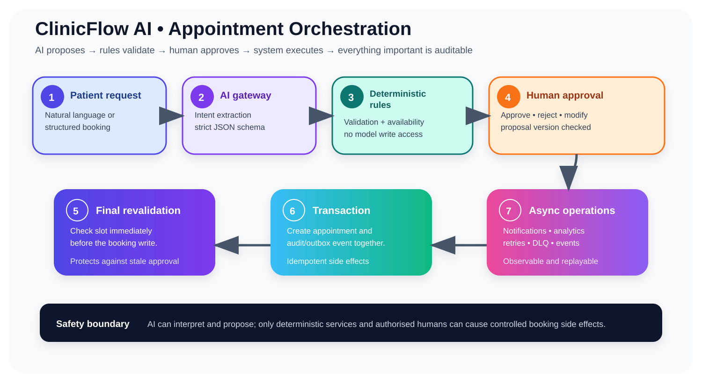
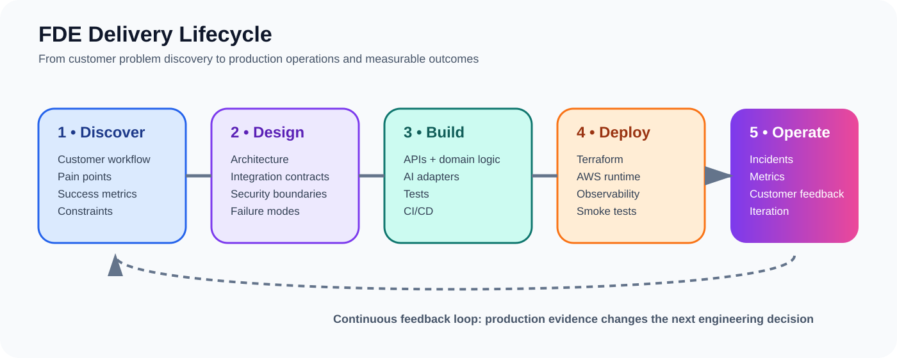
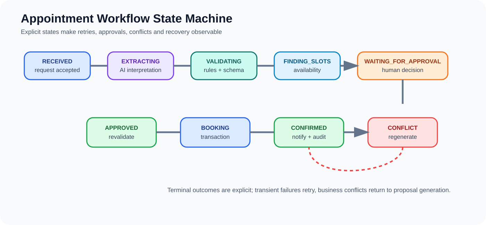

# 🏥 ClinicFlow AI

**AI-assisted, human-in-the-loop clinic appointment orchestration for a fictional customer, NorthStar Health Clinic.**

> **Core control principle:** AI proposes → deterministic rules validate → human approves → system executes → every important action is auditable.

## 🌈 Visual story

See the visual overview in docs/architecture/visual-overview.md for the full architecture illustration and presentation flow.

## 🎯 What this project demonstrates

This is a portfolio-grade Forward Deployed Engineer (FDE) project. It demonstrates customer discovery, workflow design, API engineering, AI guardrails, integration design, cloud architecture, security, observability, testing, deployment, incident response, and operational documentation.

| Capability | Demonstrated approach |
|---|---|
| Customer problem solving | Fictional NorthStar Health Clinic workflow and measurable outcomes |
| AI engineering | Structured intent extraction behind a provider abstraction |
| Human-in-the-loop | Versioned proposals, approval expiry and authorised decisions |
| Reliable automation | Explicit state machine, retries, idempotency and conflict recovery |
| Data engineering | Relational model + transactional outbox + analytics target |
| Cloud engineering | AWS target architecture with ECS/Fargate, RDS, SQS/EventBridge and Bedrock |
| FDE delivery | Discovery → design → build → deploy → operate feedback loop |

## 🛡️ Safety boundary

ClinicFlow AI uses synthetic data only. It is an administrative scheduling system, not a clinical decision-support, diagnosis, triage, or treatment system. The AI layer is intentionally constrained: it can interpret scheduling intent and propose structured actions, but it cannot directly mutate the booking database.

## 🧱 Build strategy

The project is designed local-first and cloud-ready:

- Backend: Python, FastAPI, SQLAlchemy
- Frontend: React + TypeScript
- Data: PostgreSQL in production, SQLite-compatible local bootstrap
- AI: provider abstraction with Amazon Bedrock as the AWS production adapter
- Workflow: deterministic domain state machine locally, AWS Step Functions adapter for durable production orchestration
- Async integration: transactional outbox + SQS/EventBridge
- Cloud: ECS/Fargate, RDS PostgreSQL, S3, CloudWatch, Cognito, IAM, KMS, Secrets Manager
- Infrastructure: Terraform
- CI/CD: GitHub Actions
- Observability: structured logs, correlation IDs, metrics, traces, audit events
- Testing: unit, integration, API, workflow, AI evaluation, and end-to-end tests

## 🗺️ Repository map

- docs/requirements — customer problem, personas, journeys, functional and non-functional requirements
- docs/architecture — system, integration, AI, resilience, deployment and visual architecture
- docs/database — data model, constraints, indexing, concurrency and retention decisions
- docs/api — API contract and error model
- docs/security — threat model, RBAC, privacy controls, auditability and AI safety
- docs/operations — observability, testing, deployment, incident response and cost controls
- docs/decisions — architecture decision records and rejected alternatives
- docs/assets — colorful SVG architecture and workflow illustrations
- backend — FastAPI application and domain services
- frontend — staff and patient web applications
- workers — asynchronous jobs and integration workers
- data/synthetic — reproducible synthetic clinic data
- infrastructure/terraform — AWS infrastructure as code
- .github/workflows — CI/CD automation

## 🔄 Target workflow

1. A patient expresses a scheduling request in natural language or structured form.
2. The application creates an immutable request and workflow run.
3. AI extracts scheduling intent into a strict schema.
4. Deterministic validation checks required fields and booking policy.
5. Availability is queried using deterministic scheduling rules.
6. A proposal is generated with explainable reasons and a validity window.
7. An authorised staff member approves, rejects, or modifies the proposal.
8. Booking is revalidated immediately before the write to prevent stale-slot races.
9. The appointment is created transactionally and an audit event is recorded.
10. Notifications and analytics are emitted asynchronously through the outbox.
11. Failures enter retry/DLQ/exception workflows rather than disappearing silently.

## 🧪 Engineering principle

The project deliberately separates probabilistic AI behaviour from deterministic business authority. That separation is one of the main architectural lessons demonstrated by the project.

## 📚 Documentation-first delivery

The repository now contains the runnable booking engine, staff console, AI gateway, persistence/migration layer, operational control plane, integration sandbox, and Terraform foundation. Remaining work is production AWS hardening, complete persistence-backed APIs, observability, analytics, and deployment promotion.

## ⚠️ Disclaimer

This is a portfolio engineering project using fictional entities and synthetic data. It is not an NHS or healthcare-provider production system and must not be connected to real patient data without a full security, privacy, clinical-safety, compliance, and governance programme.

## Current implementation status

The repository now includes the colourful staff console and patient request experience, AI gateway and Bedrock adapter, guarded intent extraction, persistent request/proposal/approval/appointment models, cancellation and rescheduling, idempotency, audit/outbox, SQS worker contracts, Cognito identity boundary, API Gateway edge design, ECS/RDS/VPC Terraform, Glue/Athena analytics, OpenTelemetry tracing, AI regression evaluation, Playwright browser smoke tests, external scheduler sandbox, and FDE rollout/support documentation.

Remaining work is environment-specific wiring: provision the AWS account, configure approved model access, connect the real clinic scheduling interface, and complete production promotion gates.

## Windows quickstart

Backend: create a Python 3.11 virtual environment in `backend`, install `pip install -e ".[dev]"`, then run `uvicorn app.main:app --reload`.

Frontend: run `npm install` and `npm run dev` inside `frontend`.

Quality: run Ruff, MyPy, pytest and `python -m app.ai.evaluate` inside `backend`.

Browser smoke test: run `npm install`, `npx playwright install chromium`, then `npm run test:e2e` inside `frontend`.

Docker Desktop is not required for the normal local development path.