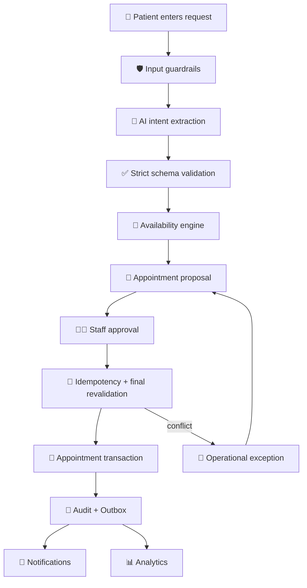

# End-to-End Demo Architecture

## Demo sequence

## What the interviewer should see

The most important demonstration is not the colour or chatbot. It is the boundary between AI and business authority:

- AI interprets unstructured language.
- deterministic services decide whether the request is valid.
- deterministic availability creates candidates.
- staff controls approval.
- the booking service revalidates the slot.
- idempotency prevents duplicate side effects.
- audit and outbox provide traceability and downstream integration.

This creates a concrete FDE narrative from customer problem to production controls.
