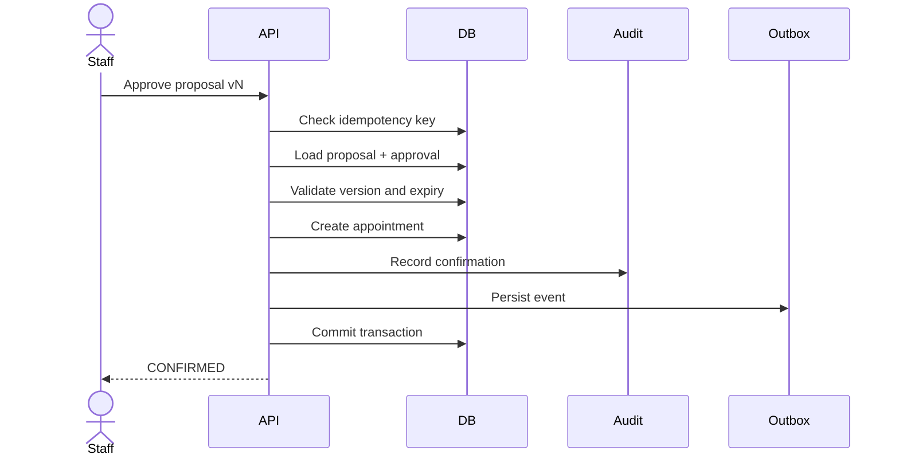

# Persistent Booking Flow

```mermaid
sequenceDiagram
  actor Staff
  participant API
  participant DB
  participant Audit
  participant Outbox

  Staff->>API: Approve proposal vN
  API->>DB: Check idempotency key
  API->>DB: Load proposal + approval
  API->>DB: Validate version and expiry
  API->>DB: Create appointment
  API->>Audit: Record confirmation
  API->>Outbox: Persist event
  API->>DB: Commit transaction
  API-->>Staff: CONFIRMED
```

The appointment, audit event and outbox record are committed together. A notification failure after commit does not invalidate the appointment.
