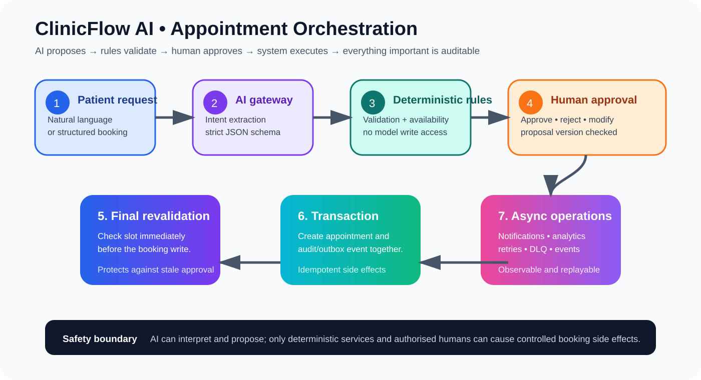

# Visual Overview

## Control plane

## Presentation flow

The visual story is intentionally aligned with the implementation story:

1. Customer request
2. AI interpretation
3. Deterministic validation
4. Human approval
5. Final consistency check
6. Transaction + audit/outbox
7. Async operations and observability

The diagrams use colour to separate user interaction, AI interpretation, deterministic controls, human approval, transactional execution and asynchronous operations.