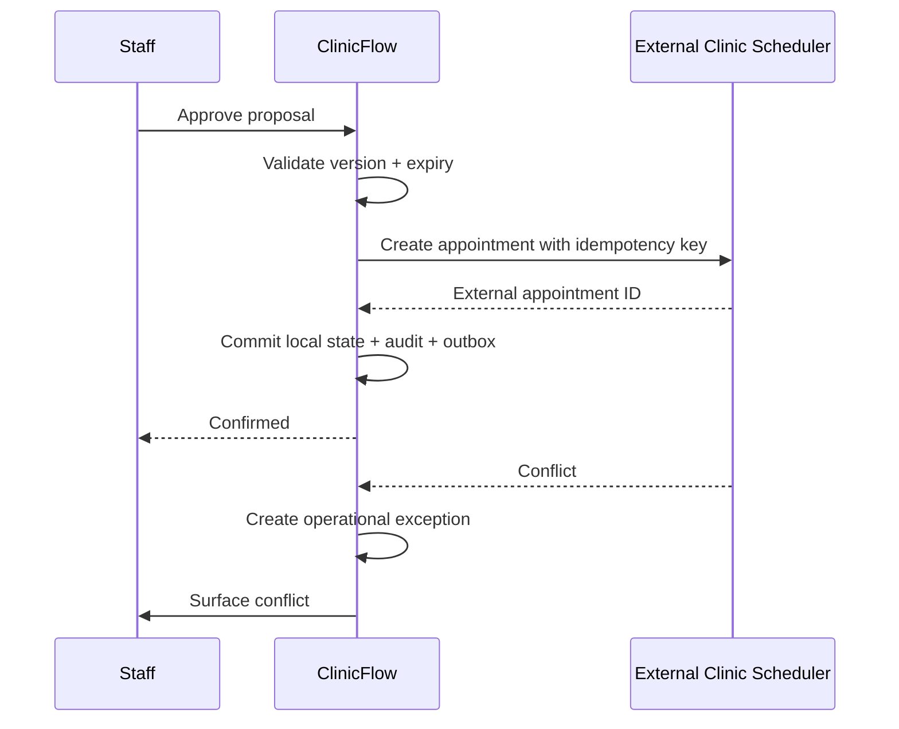

# External Integration Sequence

```mermaid
sequenceDiagram
  participant Staff
  participant ClinicFlow
  participant Scheduler as External Clinic Scheduler

  Staff->>ClinicFlow: Approve proposal
  ClinicFlow->>ClinicFlow: Validate version + expiry
  ClinicFlow->>Scheduler: Create appointment with idempotency key
  Scheduler-->>ClinicFlow: External appointment ID
  ClinicFlow->>ClinicFlow: Commit local state + audit + outbox
  ClinicFlow-->>Staff: Confirmed

  Scheduler-->>ClinicFlow: Conflict
  ClinicFlow->>ClinicFlow: Create operational exception
  ClinicFlow->>Staff: Surface conflict
```

A retry after a network timeout must not create another external appointment. The adapter therefore owns an idempotency key contract.