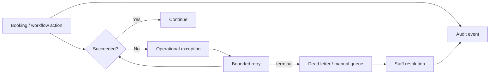

# Audit and Exception Control Room

## Why these are separate concepts

An **audit event** answers: “What happened, who initiated it, and when?”

An **operational exception** answers: “What currently needs attention?”

An event should remain part of history even after the related problem is resolved. An exception is mutable operational state that can move from OPEN to ACKNOWLEDGED to RESOLVED.

## Control-room flow

## Design requirements

- Audit history is append-oriented.
- Exceptions have explicit severity and status.
- Correlation IDs connect incidents to request and workflow traces.
- Retry count is visible.
- Sensitive free-text data is excluded from ordinary operational logs.
- Resolution notes explain human intervention.

## Production evolution

The demo stores these objects in memory. Production persists audit events and exceptions in PostgreSQL, with audit export to the analytics pipeline and operational alerts from CloudWatch.
