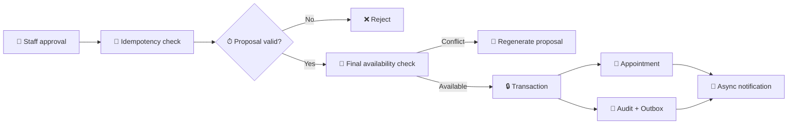

# Booking Engine

## Purpose

The booking engine is the deterministic execution boundary. AI can produce a scheduling proposal, but it cannot directly invoke a database mutation.

## Execution contract

1. A proposal is created with a version and expiry.
2. A staff approval references that proposal version.
3. The API requires an idempotency key.
4. The service checks proposal expiry.
5. The service performs a final availability check.
6. The booking write occurs only after the final check.
7. The result is stored against the idempotency key.
8. Repeated approval requests return the original result.
9. A competing booking produces a conflict rather than a duplicate appointment.

## Why the final check matters

Availability displayed in the staff UI is a snapshot. Another staff member, integration or background process may consume the slot before approval arrives. Therefore the system never trusts the UI snapshot as authority.

## Production evolution

The current service uses an in-memory demo store so the domain behaviour can be tested without AWS or Docker. The production adapter will use PostgreSQL transactions and a database constraint/locking strategy. The public service contract remains the same.

## Colour-coded flow

